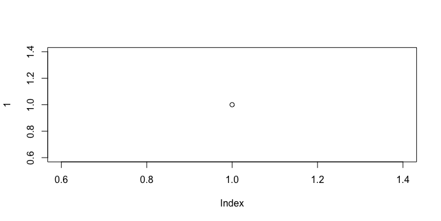

```{r setup, include=FALSE}
knitr::opts_chunk$set(echo = TRUE)
```

Note re the Word to PDF conversion. You choose 'optimize for electronic sharing and accessibility' when saving otherwise the text to word conversion is bad and the alt-text doesn't get captured.

## Test 1

```
<figure>

<figcaption>Figure caption</figcaption>
</figure>
```

<figure>

<figcaption>Figure caption</figcaption>
</figure>

* html: Good. This code will produce alt text and a separate figure caption. Screen readers will be able to interpret nicely (so says stackoverflow).
* Word: Nothing
* Word to PDF: Nothing since not in the Word doc.
* PDF: No alt-text

## Test 2


```
{r, fig.alt = "This is a figure alt text.", fig.cap = "Fig 1 this is the caption."}

```


```{r, echo=FALSE, fig.alt = "This is a figure alt text.", fig.cap = "Fig 1 this is the caption."}

```

* html: Good. This code will produce alt text and a separate figure caption. Screen readers might get more confused since the `<figure>` tag is not used.
* Word: `fig.alt` is ignored. `fig.cap` is put into the alt.fig.
* Word to PDF: alt-text is captured.
* PDF: No alt-text


## Test 3


```

```


* html: Bad. It put the alt-text with `title=` so not `alt` tag. Caption appears.
* Word: Good sort of. The alt-text appears in the alt text *along* with the figure caption. So if you read the PDF, the figure capture is read twice.
* Word to PDF: Bad. The alt-text is dropped and only the figure caption is added at alt-text. Weird!
* PDF: No alt-text

## Test 4


```


#### Figure 1. this is a caption.
```


#### Figure 1. this is a caption.

* html: Bad. It put the alt-text with `title=` so not `alt` tag. Caption looks weird.
* Word: Good sort of. The alt-text appears in the alt text alone. Caption appears below but with heading 4 style.
* Word to PDF: Good The alt-text is added. The caption appears as a heading 4.
* PDF: No alt-text and caption is not attached to the figure.

